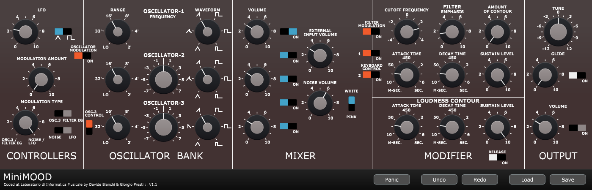

# Virtual Analog Emulation of the MiniMoog Synthesizer
The project is a Virtual Analog emulation of the famouse analog synthesizer Minimoog!  
This audio plugin is the ending project of my bachelor degree @Unimi in Computer Science.  
At this website you can download the latest version of the plugin: https://audioplugins.lim.di.unimi.it/index.php?p=2&#p17  
This video shows different ways to use the synth:  
<a href= "https://youtu.be/EyAw1Z_4Buk?si=VWnbV70ifo6lPItP" target="_blank">Click here</a>

